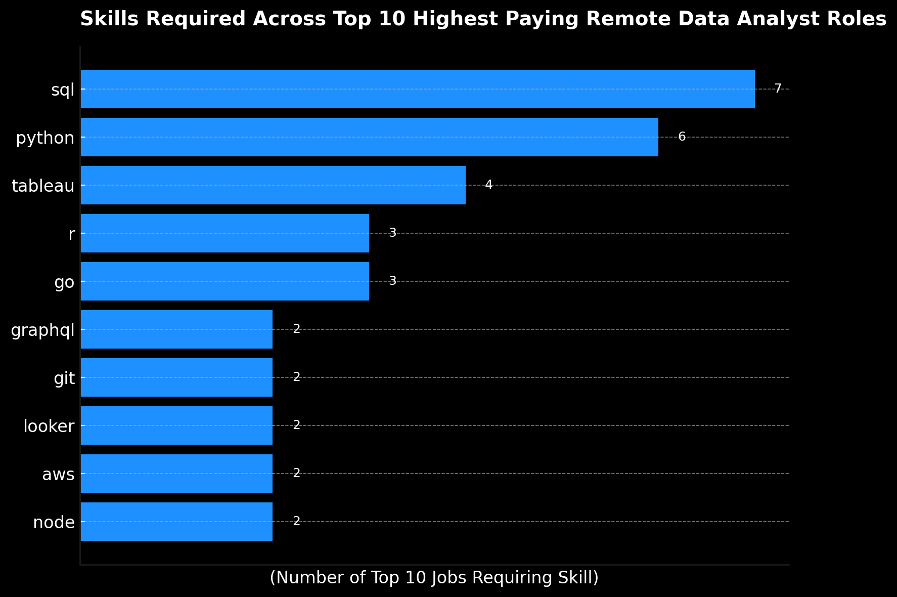

# SQL Project – Optimal Data Analyst Jobs

## INTRODUCTION
Let's dive into the data-analytics market – focusing on data-analyst roles. This study explores top-paying jobs and in-demand skills, where high demand meets high-salary in data analytics.

Review the SQL queries here:
[project_sql](/project_sql/)

## BACKGROUND
Pinpoint top paid and in-demand skills to find the optimal job opportunities. It's packed with insights on job titles, salaries, locations and essentials skills.

**Questions to Answer:**
1.	What are the top-paying jobs for my role?  What are the top paying, data-analyst jobs?  **[1_top_paying_jobs.sql]**
2.	What are the skills required for the top-paying roles?  **[2_top_paying_jobs_skills.sql]**
3.	What are the most in-demand skills for my role?  **[3_top_demanded_skills.sql]**
4.	What are the top skills based on salary for my role?
**[4_top_paying_skills.sql]**
5.	What are the most optimal skills to learn?
**[5_optimal_skills.sql]**
Optimal = HIGH Demand and HIGH Paying

### Tools Used
- **SQL** – vital to the analysis; query information and collate insights
- **PostgreSQL** – a leading database management system
- **Visual Code Editor** – database tool for creating and executing SQL queries 
- **Git & GiHub** – essential for sharing SQL queries and output as well as version control

# ANALYSIS
### Q1. What are the top paying, data-analyst jobs?
- Identify the top 100 highest paying data analyst roles that are available, remotely.
- Focuses on job postings with specified salaries, removing nulls.
- WHY? Highlight the top-paying opportunities for data analysts, 
- offering insights into employment opportunities. 

**[1_top_paying_jobs.sql]**
```
SELECT
    job_id,
    name as company_name,
    job_title,
    job_location,
    job_schedule_type,
    job_work_from_home,
    salary_year_avg,
    job_posted_date
FROM
    job_postings_fact
    LEFT JOIN company_dim ON job_postings_fact.company_id = company_dim.company_id
WHERE 
    job_title_short = 'Data Analyst' AND
    -- job_title ILIKE '%data analyst%' AND
    job_location = 'Anywhere' AND
    salary_year_avg IS NOT NULL AND
    job_work_from_home = TRUE
ORDER BY salary_year_avg DESC
LIMIT 100;
```
### Three Takeaways
✅ **1. Remote Data Analyst Roles Offer Strong Compensation Across the Board**
- Salaries range from $110K to $385K, with a median around $150K. Even mid-level roles consistently exceed six figures, reflecting a highly competitive remote market.

✅ 2. **Remote, Full Time Work Is Now the Standard**
- Nearly all roles are fully remote and full time, with minimal contract or hybrid listings. Remote is no longer a benefit — it is the default.

✅ **3. High-Paying Roles Span Multiple Industries**
- Top salaries are not limited to tech. Companies in healthcare, finance, consulting, and government offer equally competitive pay, signaling strong cross-industry demand.

### Q2. What skills are required for the top paying data analyst jobs?

- Use the top 10, highest-paying Data Analyst jobs from the first query.
- Add the specific skills required for these roles.
- WHY?  It provides a detailed look at which high-paying jobs demand certains skills, helping job seekers understand, which skills to develop that align with top salaries. 
**[2_top_paying_job_skills.sql]**
```
WITH top_paying_jobs AS
(
    SELECT
        job_id,
        name as company_name,
        job_title,
        -- job_location,
        -- job_schedule_type,
        salary_year_avg
        -- job_posted_date
    FROM
        job_postings_fact AS j_p_f
        LEFT JOIN company_dim ON j_p_f.company_id = company_dim.company_id
    WHERE 
        job_title_short = 'Data Analyst' AND
        -- job_title ILIKE '%data analyst%' AND
        job_location = 'Anywhere' AND
        salary_year_avg IS NOT NULL AND
        job_work_from_home = TRUE
    ORDER BY salary_year_avg DESC
)
SELECT
    t_p_j.job_id,
    company_name,
    t_p_j.job_title,
    t_p_j.salary_year_avg,
    skills,
    type 
FROM 
    top_paying_jobs AS t_p_j
LEFT JOIN skills_job_dim AS s_j_d ON t_p_j.job_id = s_j_d.job_id
INNER JOIN skills_dim ON s_j_d.skill_id = skills_dim.skill_id
ORDER BY salary_year_avg DESC
;
```

*ChatGPT generated graph from my SQL output for this question.*

### Three Takeaways
✅ **1. SQL Dominates High-Paying Roles**
SQL is required in 7 out of the top 10 jobs, making it the single most critical skill for data analysts aiming at top-tier salaries.
This reinforces SQL as the foundation for working with data across industries.

✅ **2. Programming and Analytics Tools Drive Competitiveness**
- Skills like Python, R and Tableau appear multiple times, showing that coding and advanced analytics/visualization tools are strong differentiators. 
- Employers paying higher salaries expect analysts to go beyond spreadsheets into scripting, automation, and dashboarding.

✅ **3. **Cloud and Big Data Skills Emerging as Salary Boosters**
- Tools like Snowflake, AWS, and Spark appear in some of the top-paying roles. They are tied to the very highest-paying analyst positions, suggesting a premium for analysts who can handle large scale, modern data stack.

### Q3. What skills are required for the top paying data analyst jobs?
- Identify the top 5 in-demand skills for a data analyst
- Focus on all job postings
- WHY?  Retrieves the top 5 skills with the highest demand in the 
job market, providing insights into the most valuable skills for job seekers. 

**[3_top_demanded_skills.sql]**
```
    SELECT 
        -- job_postings_fact.job_id,
        -- skills_job_dim.skill_id,
        skills_dim.skills,
        COUNT (skills_dim.skills) AS demand_count
    FROM 
        job_postings_fact
    INNER JOIN
        skills_job_dim ON job_postings_fact.job_id = skills_job_dim.job_id
    INNER JOIN
        skills_dim ON skills_job_dim.skill_id = skills_dim.skill_id
    WHERE 
        job_title_short LIKE '%Data Analyst%' AND
        job_work_from_home = TRUE
    GROUP BY
        skills_dim.skills
    ORDER BY demand_count DESC
    LIMIT 10;
```

| Skill   | Demand Count |
| :------ | -----------: |
| SQL     |       18,771 |
| Python  |       12,135 |
| Excel   |       10,511 |
| Tableau |       10,136 |
### Three Takeaways
✅ 1. SQL is the Cornerstone Skill
- With nearly 18,000 job postings listing it, SQL is the most requested skill by far.

✅ 2. Programming and Analytics Tools are Critical
- Python ranks second (~12,000 postings), reflecting the shift toward automation, advanced analytics and data science overlap.
- Excel and Tableau remain highly in demand (10k+ postings each), showing that both traditional spreadsheets and modern-visualization tools are must-haves.

✅ 3. Power BI & Tableau Top Data-Visulization Tools
- With around 7,000 postings, Power BI is nearly as common as Tableau, showing that employers value both platforms. Proficiency in at least one major visualizationo tool is a necessity

### Q4. What are the top skills based on salary?
- Looks at the average salary associated with each skill for data analyst positions
- Focuses on roles with specified salaries, regardless of location
- WHY?  To reveal how different skills impact salary levels for data analysts and helps identify the most financially rewarding skills to acquire or improve 

**[4_top_paying_job_skills.sql]**
```
      SELECT 
          skills_dim.skills,
          ROUND(AVG(salary_year_avg), 0) AS avg_salary
      FROM 
          job_postings_fact
      INNER JOIN
          skills_job_dim ON job_postings_fact.job_id = skills_job_dim.job_id
      INNER JOIN
          skills_dim ON skills_job_dim.skill_id = skills_dim.skill_id
      WHERE 
          job_title_short LIKE '%Data Analyst%' AND
          salary_year_avg IS NOT NULL AND
          job_work_from_home = TRUE
      GROUP BY
          skills_dim.skills
      ORDER BY avg_salary DESC
      LIMIT 25;
```
| Skill      | Avg. Salary (USD) |
|:-----------|------------------:|
| TypeScript |         445,000   |
| GraphQL    |         264,000   |
| Node       |         201,875   |
| Bitbucket  |         189,155   |
| FastAPI    |         185,000   |
| Trello     |         171,396   |
| Workfront  |         165,000   |
| Couchbase  |         160,515   |
| PySpark    |         158,983   |
| Perl       |         158,000   |
### Three Takeaways
✅ 1. Programming & Engineering Skills 
- The top-paying skills — like typescript, graphql and node are not traditional data analysis tools, but software development and backend programming languages.
- This shows that data analyst roles with strong programming or data engineering responsibilities tend to earn significantly more.

✅ 2. Enterprise & Development Tools Are Tied to Higher Salariest
- Skills like bitbucket, fastapi, trello and workfront are not traditional analytics tools — they’re used for code collaboration, API development and project/workflow management.
- Analysts with experience in modern development or enterprise toolsets are realizing higher pay

✅ 3. Core Data Tools Offer Solid but Not Top-Tier Salaries
- Knowing data tools alone may not be enough to reach the highest salary brackets — combining them with software engineering or API-related skills can give analysts a competitive edge and access to higher-paying roles.
- If you're considering skill development, focusing on cross-functional technical skills that bridge analytics, engineering and deployment suggest the highest-financial returns.

### Q5. What are the most optimal skills to learn, i.e. high pay and demand?
- Identify skills in high demand and associated with high-average salaries for data-analyst roles
- Concentrates on remote positions with specified salaries
- WHY?  Targets skills that offer high job security (high demand) and financial benefits (high salary),
offering strategic insights for career development in data analysis

**[5_optimal_skills.sql]**
```
WITH skill_demand AS 
(
    SELECT 
        skills_dim.skill_id,
        skills_dim.skills,
        COUNT(skills_dim.skills) AS demand_count
    FROM 
        job_postings_fact
    INNER JOIN skills_job_dim 
        ON job_postings_fact.job_id = skills_job_dim.job_id
    INNER JOIN skills_dim 
        ON skills_job_dim.skill_id = skills_dim.skill_id
    WHERE 
        job_title_short LIKE '%Data Analyst%'
        AND job_work_from_home = TRUE
    GROUP BY 
        skills_dim.skill_id,
        skills_dim.skills
),
top_paying_skills AS 
(
    SELECT 
        skills_dim.skill_id,
        -- skills_dim.skills,
        ROUND(AVG(salary_year_avg), 0) AS avg_salary
    FROM 
        job_postings_fact
    INNER JOIN skills_job_dim 
        ON job_postings_fact.job_id = skills_job_dim.job_id
    INNER JOIN skills_dim 
        ON skills_job_dim.skill_id = skills_dim.skill_id
    WHERE 
        job_title_short LIKE '%Data Analyst%'
        AND salary_year_avg IS NOT NULL
        AND job_work_from_home = TRUE
    GROUP BY 
        skills_dim.skill_id
)
SELECT 
    skill_demand.skill_id,
    skill_demand.skills,
    demand_count,
    avg_salary
FROM 
    skill_demand
INNER JOIN top_paying_skills AS t_p_s 
    ON skill_demand.skill_id = t_p_s.skill_id
ORDER BY
    demand_count DESC,
    skill_demand.skills DESC, 
    avg_salary DESC
LIMIT 25;
```

*Gemini generated graph from my SQL output for this question.*
### Three Takeaways
✅ 1. Fundamental SQL and Python are Non-Negotiable
- SQL and Python exhibit the highest demand by a significant margin. This confirms they are essential foundational skills for job security and market entry. Their average salaries are competitive, but not the absolute highest on the list, suggesting that they might not be the sole drivers of a premium salary compared to some specialized skills.
2.	Specialization in Cloud & Advanced Technologies Leads to Superior Earnings
- The highest average salaries are consistently associated with specialized or advanced skills, such as Databricks, Jira, Go and SAP. All command higher salaries, often above the $120,000 mark, despite having lower demand counts (below 2,500). Learning one of these skills, offers the greatest financial return on a per-job basis.
3.	Data Visualization Tools Offer a Balance of High Demand and High Pay
- Tableau stands out as a sweet spot, offering high demand (10,136) coupled with a robust average salary ($105,507). Among the visualization and business-intelligence tools (Excel, Power BI, Looker), Tableau has both the highest demand and the highest average salary, making it an excellent  choice for analysts looking to maximize both job security and earning potential, without diving into highly-niche technologies.

# INSIGHTS
## Iterate. Iterate. Iterate.
Learned the value of approaching problems step by step. By iterating through the problem statements, I was able to craft advanced-SQL queries—building them brick by brick, refining logic along the way.

## Data Aggregation
Developed a deeper understanding of aggregate functions like COUNT, AVG, and GROUP BY. These became essential tools for extracting meaningful insights from raw data.

## Analytical Skills
Sharpened my analytical and problem-solving abilities by working through real-world business questions. I learned how to translate those questions into structured, actionable SQL queries that delivered valuable insights.
# FINAL THOUGHTS
Remote work is the norm, with no falloff or penalty in salary. The median salary is $150,000. The highest salary reported was $650,000 in the wide-ranging data analyst industry. These roles span multiple industries, including healthcare, finance, and government.
SQL dominates high-paying roles, with skills like Python, R, and Tableau appearing repeatedly—showing that coding and advanced analytics/visualization tools are strong differentiators. Analysts are expected to go beyond spreadsheets into scripting, automation, and dashboarding.
Programming and engineering skills in enterprise environments drive the highest salaries, leaning heavily on computer science and/or engineering training. The trade-off is that this IT-heavy focus can be far removed from the business and sales side of the organization.
SQL and Python are non-negotiable, showing the highest demand by a significant margin.
Specialization in cloud and advanced technologies leads to superior earnings. The highest average salaries consistently align with specialized or advanced skills. Tools like Databricks, Jira, Go, and SAP command higher salaries—often above $120,000—despite lower overall demand.
Data visualization tools offer a balance of high demand and high pay. Tableau stands out as a sweet spot, with strong demand (10,136) and a robust average salary ($105,507). Among visualization and business intelligence tools—Excel, Power BI, Looker—Tableau leads in both demand and average salary, making it an excellent choice for analysts seeking strong job security and earning potential without diving into highly niche technologies.

The results of this analysis serve as a guide to prioritizing skills development and job-search efforts.  Aspiring data analysts can better position themselves in a competitive data market by focusing on high demand and high salary skills.

Keep learning!


